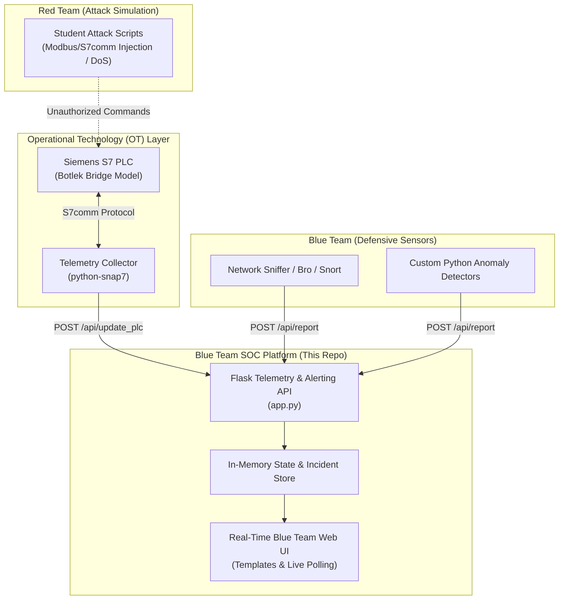

<div align="center">

# 🌉 Hack the Bridge — ICS/OT SOC Simulator
### Industrial Control Systems (ICS) Blue Team Monitoring & Siemens PLC Attack Simulation Engine

[](https://github.com/fabjan4u/hack-the-bridge-soc/actions)
[](LICENSE)
[](https://python.org)
[](Dockerfile)
[](https://dutchinnovationpark.nl)
[](https://civ-smarttechnology.nl)

**The digital backbone and Security Operations Center (SOC) dashboard for the *Hack the Bridge* challenge at the Cyber Security Living Lab (CSyLL).**  
*Developed in collaboration with mboRijnland, CIV Smart Technology, Siemens, and The Hague University of Applied Sciences.*

[Overview](#-project-overview) • [Architecture](#-architecture) • [Quick Start](#-quick-start) • [API Reference](#-api-reference) • [Siemens PLC Integration](#-siemens-plc-integration) • [Didactic Context](#-educational--didactic-framework)

---

</div>

## 📌 Project Overview

Securing critical national infrastructure requires defending Operational Technology (OT) and Industrial Control Systems (ICS) against sophisticated cyber threats. Unlike traditional IT environments, industrial networks rely on physical programmable logic controllers (PLCs), fieldbus protocols, and deterministic real-time requirements where downtime can cause physical catastrophe.

**Hack the Bridge** is an authentic educational simulation and living lab initiative centered around a functional physical scale model of the **Botlek Bridge** driven by Siemens S7 PLCs. 

This repository provides the **Blue Team SOC Dashboard & Telemetry Engine**, serving as:
1. **Real-Time OT Telemetry Central:** Continuously tracks industrial operational parameters (motor RPM, hydraulic bearing temperature, PLC runtime state).
2. **Defensive Incident Intake API:** A centralized REST endpoint where student-developed intrusion detection scripts, network sniffers, and anomaly detectors report live threats.
3. **Automated Anomaly Correlation:** Automatically flags critical state changes (e.g. emergency stops, speed fluctuations, or temperature spikes) as high-severity security incidents.

---

## 🏛️ Architecture



---

## ⚡ Quick Start

### Option 1: Docker (Recommended)
Run the entire platform in an isolated container in seconds:

```bash
# Clone the repository
git clone https://github.com/fabjan4u/hack-the-bridge-soc.git
cd hack-the-bridge-soc

# Launch with Docker Compose
docker compose up -d

# Open the dashboard
open http://localhost:5000
```

### Option 2: Local Python Environment
```bash
# 1. Clone repository
git clone https://github.com/fabjan4u/hack-the-bridge-soc.git
cd hack-the-bridge-soc

# 2. Install dependencies
pip install -r requirements.txt

# 3. Start the SOC engine
python app.py
```
Open your browser at `http://localhost:5000`.

---

## 📡 API Reference

The SOC server exposes lightweight REST endpoints for telemetry ingestion and defensive alerting:

### 1. `GET /api/status`
Returns the current live operational state of the PLC.
```json
{
  "status": "RUN",
  "speed": 1500,
  "temperature": 45.5,
  "last_update": "21:45:12"
}
```

### 2. `GET /api/alerts`
Retrieves the 50 most recent security alerts, ordered chronologically (newest first).

### 3. `POST /api/report`
Used by student Blue Team detection scripts to push security findings to the dashboard.

**Request Payload:**
```json
{
  "message": "Unauthorized S7comm command injection detected from IP 192.168.1.105",
  "severity": "HIGH",
  "source": "OT-Suricata-Sensor"
}
```

**Python Example:**
```python
import requests

payload = {
    "message": "Abnormal motor RPM detected: 2800 RPM exceeds safe threshold",
    "severity": "HIGH",
    "source": "TelemetryMonitor-01"
}
requests.post("http://localhost:5000/api/report", json=payload)
```

### 4. `POST /api/update_plc`
Updates simulated or real PLC variables and triggers automated safety alert correlation.
```json
{
  "status": "STOP",
  "speed": 0,
  "temperature": 82.3
}
```
*(Setting `"status": "STOP"` automatically generates a critical priority security alert).*

---

## 🔌 Siemens PLC Hardware Integration

To stream live data from a physical **Siemens S7-1200 or S7-1500 PLC** into this SOC dashboard:

1. Enable **"Permit access with PUT/GET communication from remote partner"** in Siemens TIA Portal.
2. Ensure the Data Block (DB) is non-optimized.
3. Use the Python `python-snap7` collector snippet:

```python
import snap7
from snap7.util import get_bool, get_real
import requests, time

plc = snap7.client.Client()
plc.connect('192.168.1.200', 0, 1) # IP, Rack, Slot

while True:
    data = plc.db_read(1, 0, 16) # Read DB1
    motor_speed = get_real(data, 0)
    temperature = get_real(data, 4)
    status = "RUN" if get_bool(data, 8, 0) else "STOP"

    requests.post("http://localhost:5000/api/update_plc", json={
        "status": status,
        "speed": motor_speed,
        "temperature": temperature
    })
    time.sleep(1)
```

---

## 🎓 Educational & Didactic Framework

Developed within the **Cyber Security Living Lab (CSyLL)** in the **Dutch Innovation Park** (Zoetermeer), this project demonstrates practical cross-tier collaboration between vocational education (**mboRijnland**), applied sciences (**De Haagse Hogeschool**), and industry (**Siemens**).

> *"Als docent is het niet mijn taak om kopietjes van mezelf te maken — het doel is studenten opleiden die zelfstandig, nieuwsgierig en creatief complexe technische uitdagingen oplossen."*  
> — **Fabian Cras**, Teacher-Researcher

### Lab Scenario: Red vs. Blue Team
* **Red Team Students:** Tasked with reconnaissance, analyzing unencrypted industrial protocols (Modbus TCP, S7comm), identifying vulnerabilities in bridge logic, and attempting unauthorized manipulation.
* **Blue Team Students:** Tasked with building defensive telemetry monitors, intercepting rogue network packets, writing custom parser scripts, and alerting the SOC operator via the `/api/report` API.

---

## 🤝 Contributing & Community

Contributions, new detection scripts, and classroom lab scenarios are warmly welcomed!
Please read [CONTRIBUTING.md](CONTRIBUTING.md) and [SECURITY.md](SECURITY.md) for contribution rules and security disclosure practices.

---

## 📜 License & Citation

* **License:** Distributed under the [MIT License](LICENSE).
* **Research Citation:** If you use this platform in educational or academic research, please cite:

```bibtex
@misc{cras2026hackthebridge,
  author = {Fabian Cras},
  title = {Hack the Bridge: Industrial Control Systems (ICS/OT) SOC Simulator and Educational Living Lab Framework},
  year = {2026},
  publisher = {GitHub},
  howpublished = {\url{https://github.com/fabjan4u/hack-the-bridge-soc}}
}
```
